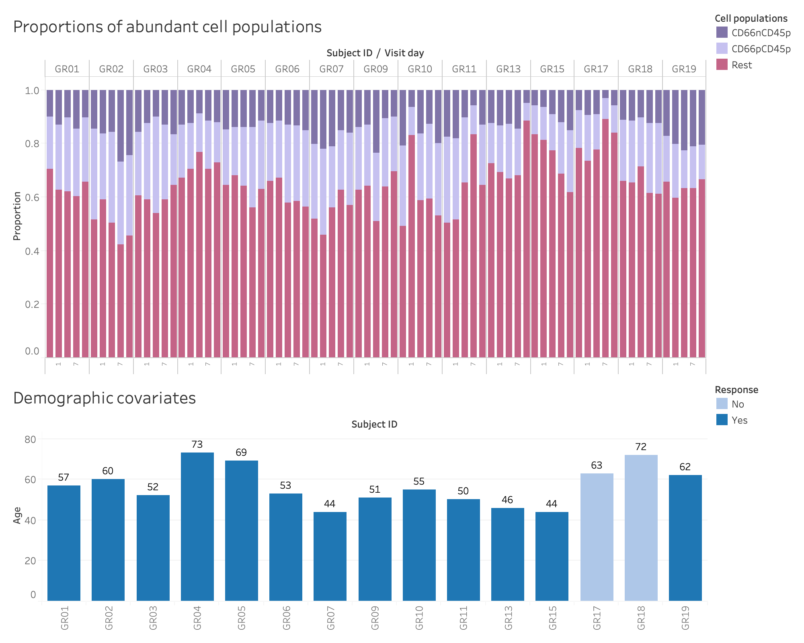
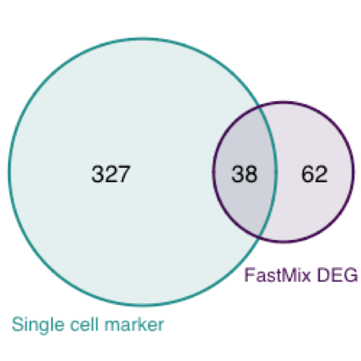

```{r setup, include=FALSE}
knitr::opts_chunk$set(echo = TRUE, cache = TRUE)
```

<br>

## Overview

The __goal__ of this analysis is to apply deconvolutional model to identify _cell type-specific_ differentially expressed genes (csDEGs). In this project, we have both flow cytometry and gene expression data on the same samples. The deconvolutional model will be built on the bulk RNA-seq data with known cell proportions estimated from the flow cytometry data.

With flow cytometry data, we can identify proportions of different cell populations from the whole blood samples. Identification of cell populations and estimation of corresponding cell proportions are done using the [DAFi](https://www.ncbi.nlm.nih.gov/pubmed/29665244) approach we recently developed. DAFi is an automated gating strategy that can effectively reduce human bias in the subjective manual gating analysis.

The deconvolutional model, dubbed as "FastMix", is a new analytic pipeline co-developed by our team, that combines the deconvolution step with downstream analysis based on linear mixed-effects regression model. It takes gene expression data, cell proportions, and demographic covariates as input, and fits a linear mixed-effects model using a novel computationally-efficient moment-based covariance estimator, which is robust and can achieve comparable accuracy with the traditional EM-based mixed-effects model fitting algorithm. Based on the deconvolutional model, the analytical pipeline also provides a novel comptetitive hypothesis test to identify genes that have significantly larger or smaller predicted random effect (cell type-specific expression) with a given covariate, a.k.a. csDEGs. To learn more about `FastMix`, please read [here](https://github.com/terrysun0302/FastMix).

This report is organized in the following sections.

- [Cell proprotions and demographic covariates](#data). Detailed view of the data to be used in the model. Note that the within-subject [correlation](#rhohat) is _not_ negligble.
- [Model fitting](#WModel4). Fit the FastMix model: $$\mbox{gene expression ~ cell proportions + response after dose 2 + age}.$$
- [Downstream analyses](#downstream):
    + [Identification of cell type-specific markers](#csDEGs). Neutrophil markers are identified as the fixed effect inference from the deconvolutional model.
    + [Validation with scRNA-seq markers](#scRNAseq). The above neutrophil markers derived from the deconvolutional model are validated with the neutrophil markers derived from an independent single cell RNA-seq data analysis on the same subjects. A significant amount of commonly identified marker genes are reported.
    + [csDEGs and pathway analysis](#path). csDEGs are identified from the novel hypothesis test on the random effect predictions, and pathway enrichment analysis is performed on the top csDEGs to understand their biological functions using [ReactomePA](https://bioconductor.org/packages/devel/bioc/vignettes/ReactomePA/inst/doc/ReactomePA.html).

Load useful packages.
```{r package, message=FALSE, warning=FALSE, catch=FALSE}
library(FastMix)
library(ReactomePA)
```

<br>

## Cell proportions and demographic covariates {#data}

### Cell proportions

We load cell proportions from the file "HVP_CD66CD45Subsets.csv" to `cellprop`. 

```{r cellprop}
cellprop <- read.csv("../HVP_CD66CD45Subsets.csv", row.names = 1)
```

For this deconvolution analysis, we work with three abundant cell populations:

- the CD66 positive and CD45 positive (CD66pCD45p) population - this is the neutrophil cell type,
- the CD66 negative and CD45 positive (CD66nCD45p) population, and
- the rest population - for all other cells.

The average proportions for the above cell populations are `r round(colMeans(cellprop),3)`, respectively. Cell proportions sum up to `r mean(rowSums(cellprop))`.

###  Demographic covariates

We consider two demographic covariates: response after dose 2 and age. From the 
```{r, echo=FALSE, results='asis'} 
cat("<a href='bulk.html#ctab'>sample table</a>")
```
, we curate and store those covariates in `demo`.

```{r demo}
demo <- ctab %>% column_to_rownames(var="Sample_name") %>% dplyr::select(Responder_dose2, Age)
demo$Responder_dose2 <- as.numeric(demo$Responder_dose2)
```

###  All covariates

The following figures show detailed overview of cell proportions and demographic covariates.
{width=90%}

### Within-subject correlation {#rhohat}

To make the best use of the multiple time points data, we use PBtest again to estimate the within-subject correlation, which will be provided to the weighted FastMix model for handling repeated measurements.

```{r rhohat}
cov_matrix <- PBtest::getSigma(t(dat.filt10.symbol), ctab$Responder_dose2, ctab$Subject_id)
(rhohat <- cov_matrix[2])
```

_Note that there is quite strong correlation (= `r round(rhohat,3)`) within-subject, ignoring which is not recommended._

<br>

## Model fitting {#WModel4} 

Recall that our deconvolutional model is a regression-like model associating the bulk gene expression level with the covariates.
$$\mbox{gene expression ~ cell proportions + response after dose 2 + age}$$

Using `cellprop`, `demo`, and `cov_matrix` obtained above, we fit the deconvolution model for the bulk RNA-seq data `dat.filt10.symbol` as follows.

```{r mod}
set.seed(1234)
mod <- FastMix(GeneExp=dat.filt10.symbol, CellProp=cellprop, Demo=demo,
               independent=F, include.demo=FALSE, cov_matrix=cov_matrix)
round(mod$fixed.results, 4)
colSums(mod$re.ind.pvalue < 0.05)
```
The above are number of cell type-specific markers (`r colnames(mod$re.ind.pvalue)[1:3]`) and csDEGs for each interaction terms (`r colnames(mod$re.ind.pvalue)[-(1:3)]`).

<br>

## Downstream analyses {#downstream}

We use the following chunk to perform downstream analyses all at one pass.
```{r downstream, message=FALSE}
Ntop <- 100
## map gene symbols to entrez ids
library(org.Hs.eg.db)
map2entrez <- mapIds(org.Hs.eg.db, rownames(dat.filt10.symbol), 'ENTREZID', 'SYMBOL')
## pathway analysis for each random-effect/cell-type-specific DEG list
covariates <- rownames(mod$fixed.results)
lst.top.DEG <- lst.sig.path <- vector("list", length=length(covariates))
names(lst.top.DEG) <- names(lst.sig.path) <- covariates
for(term in covariates){
  # cat(term, "\n")
  top.genes <- names(sort(mod$re.ind.pvalue[,term])[1:Ntop])
  sig.path <- enrichPathway(gene=map2entrez[top.genes], pvalueCutoff=0.05, readable=T)
  lst.sig.path[[term]] <- sig.path
  lst.top.DEG[[term]] <- top.genes
}
## top DEGs
tab.top.DEG <- do.call("cbind", lst.top.DEG)
```

### Identification of cell type-specific markers {#csDEGs}

For now, let's focus on the top `r Ntop` markers or csDEGs from the deconvolutional model. Table below is ordered in increasing p-values (most siginificant to least significant) column-wise.

```{r topgenes}
## top DEGs
kable(tab.top.DEG) %>%
  add_header_above(c("Cell type-specific markers" = 3, "csDEGs" = 6)) %>%
  kable_styling() %>%
  scroll_box(width = "100%", height = "500px")
```

The first column is the neutrophil markers derived from the deconvolutional model. The top neutrophil markers are `r head(tab.top.DEG[,1])`.

### Validation with scRNA-seq markers {#scRNAseq}

Independently, single immune cell RNA-seq data are analyzed by Brian Aevermann, following the [Louvain clustering](https://arxiv.org/abs/0803.0476) for cell populations identification and [MAST](https://genomebiology.biomedcentral.com/articles/10.1186/s13059-015-0844-5) generalized linear model for marker gene identification of the identified cell population clusters. Neutrophils are one of the major cell population clusters identified in the single cell analysis. The single cell analysis identified 365 markers for the neutrophils, which is available upon request. 

We overlay the two marker genes list in the following venn diagram. A hypergeometric test shows the overlapping of the venn diagram is highly significant. 

{width=30%}

```{r hypergeom}
## hypergeometric test
phyper(38,365,13157-365,100, lower.tail=FALSE)
```

The common marker genes are
```{r commongenes}
## read in the common marker genes from a pre-saved file
commongenes <- read.csv("../tab_commongenes_singlecell_comparison_top100.csv", col.names = "Marker gene")
commongenes
```

### csDEGs and pathway analysis {#path} 

Also we looked at the top `r Ntop` csDEGs for each interaction term. Based on these csDEGs, we performed pathway analysis using the [Reactome pathways](https://reactome.org/) and [ReactomePA Bioconductor package](https://bioconductor.org/packages/devel/bioc/vignettes/ReactomePA/inst/doc/ReactomePA.html). 

Below are significant pathways identified for the interaction term with the response covariate after dose 2. We see that the interferon immune signaling related pathways are frequently picked up.


```{r sigpath}
## significant pathways 
lapply(lst.sig.path[4:6], function(z) z$Description)
```


